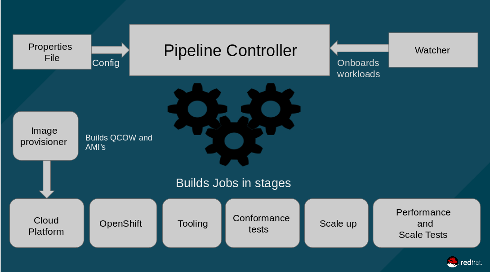

# SCALE-CI-PIPELINE
Automates the installation of OCP on various cloud platforms and runs performance and scale tests related to kubelet density, control plane, http, storage, prometheus and cluster limits.

NOTE: This is also maintained at [openshift/aos-cd-jobs repo](https://github.com/openshift/aos-cd-jobs).


### Dependencies
```
- Running Jenkins instance.
```

## Components
- Properties files
- Pipeline scripts
- Scale-ci-watcher
- Scale-ci-linter




### Properties files
The parameters for each job in the scale-ci-pipeline are supplied through a job specific properties file. It contains key=value pairs, sample properties for all the supported jobs are hosted in scale-ci-pipeline/properties-files.

The properties for the OCP large scale and per sprint test runs are maintained at [scale-ci-properties](https://github.com/redhat-performance/scale-ci-properties).

### Pipeline scripts
These scripts are responsible for parsing the properties files and building the respective job.

### Scale-ci-watcher
This looks for changes to the JJB templates or new templates and updates/onboards the jobs into the scale-ci-pipeline. The watcher also supports xml format, it has the support to convert them to JJB format. The scale-ci-watcher gets kicked off as the first job in the pipeline, it will pick up the changes made to the templates if there are any and applies them to the respective job.

It gives us an option to choose whether to update the Jobs in Jenkins and it does is by organizing the templates into dynamic and static directories inside of scale-ci-pipeline/jjb directory.
   * #### Dynamic
     This directory contains the dynamic job templates managed by scale-ci-watcher for the scale-ci-pipeline which is used to test OpenShift at scale.

   * #### Static
     This directory contains the static job templates in the scale-ci-pipeline which are not managed by scale-ci-watcher.

### Scale-ci-linter
Validates scale-ci templates to analyze them for potential errors for every commit. This can be run locally as well in case we want to check before pushing the commit:
```
$ pip install yamllint
$ ./scale-ci-linter.sh <path-to-the-template>
```

### Supported Jobs by Scale-CI
Job   | OCP component/category | Description | Managed by scale-ci-watcher | OCP-3.X | OCP-4.X
----------------- | --------- | -------------------- | ----------- | ------------------ | ----------- |  
OpenShift install | Installer | Installs OCP cluster | In progress | :heavy_check_mark: | In progress |  
Conformance | OCP/kubernetes e2e tests | Checks if the OCP cluster is sane | In progress | :heavy_check_mark: | :heavy_check_mark: |  
Scaleup | scaleup | Scales up OCP cluster to a desired node count | In progress | :heavy_check_mark: | :heavy_check_mark: |  
Node Vertical | Kubelet performance and Cluster Limits | Creates max pods per compute node | In progress | :heavy_check_mark: | :heavy_check_mark: |  
Master Vertical | Control plane density | Creates bunch of objects to stress ApiServer, Etcd and Controller | In progress | :heavy_check_mark: | :heavy_check_mark: |  
Networking | SDN | uperf benchmarks testing node to node, pod to pod, and svc to svc throughput and latency for TCP and UDP protocols | In progress | :heavy_check_mark: | :heavy_check_mark: |  
Prometheus | Monitoring | prometheus density focused test that creates pods, and nodes and some workloads especially for openshift-monitoring | In progress | :heavy_check_mark: | :heavy_check_mark: |  
HTTP | Router | Data-plane workload generator that runs http requests through HAProxy into deployed pods | In progress | :heavy_check_mark: | :heavy_check_mark: |  
Pgbench | Storage | Checks how well Postgresql performs with RHOCS for glusterfs and gluster-block storage backend | In progress | :heavy_check_mark: | :heavy_check_mark: |  
MongoDB | Storage | Checks how MongoDB performs with RHOCS for glusterfs and gluster-block storage backend | In progess | :heavy_check_mark: | :heavy_check_mark: |  
Pod Vertical | Cluster Limits | Tests pods per namespace limit | In progress | :heavy_check_mark: | :heavy_check_mark: |  
Deployments per namespaces | Cluster Limits | Tests deployments per namespace limit | In progress | :heavy_check_mark: | :heavy_check_mark: |  
Namespaces per cluster | Cluster Limits | Tests namespaces per cluster limit | In progress | :heavy_check_mark: | :heavy_check_mark: |  
Services per namespace | Cluster Limits | Tests maximum number of services possible per namespace | In progress | :heavy_check_mark: | :heavy_check_mark: |

NOTE: Services per namespace cluster limits test is covered by Deployments per ns test, creating a separate job for it is in progress.

### Test setup/Migrating scale-ci jobs to any Jenkins
The following instructions will help you setup a jenkins test environment super quick so as to play around and test the changes locally before pushing them to production.
```
$ docker run -d --name scale-ci-jenkins -p 8080:8080 jenkins/jenkins:lts
```
Grab the admin password from the scale-ci-jenkins container logs:
```
$ docker logs scale-ci-jenkins
```
Access the jenkins at http://<host>:8080 and proceed with the initial setup. A new user instead of admin user and installing all the suggested plugins is highly recommended.
Once we have the jenkins up and running, run the scale-ci-watcher to push your templates to the test jenkins instance:
```
$ git clone https://github.com/openshift-scale/scale-ci-pipeline.git
$ cd scale-ci-pipeline
$ # Set the variables in the scale-ci-watcher-env.sh and source it
$ source scale-ci-watcher-env.sh
$ # Set the jenkins user name, url and passwd in the scale-ci-watcher config file
$ vi config/jjb.ini
$ # Run the scale-ci-watcher and check the jobs in the jenkins ( Make sure python six module version is >=1.10.0 )
$ ./scale-ci-watcher.sh
$ # Running the scale-ci-watcher when we don't have the SSL certs needed to verify https when hitting Jenkins api ( check if needed )
$ export PYTHONHTTPSVERIFY=0; ./scale-ci-watcher.sh
```

### Scale-CI Jenkins agents/slaves
We use bunch of dedicated slaves part of OpenShift-QE Jenkins to run Scale-CI jobs. The slaves are always online instead of the on demand slaves which take time to get ready before scheduling the jobs. There are multiple slaves and executors, so we should be able to run jobs in parallel.

If a slave with different dependencies for example ansible version is needed by the job, please open an [issue](https://github.com/openshift-scale/scale-ci-pipeline/issues) and we will create a slave which will meet the requirements.

Here is the list of current scale-ci labeled slaves:

Slaves           | Number of executors | Label            | Ansible version |
---------------- | ------------------- | ---------------- | --------------- |
scale-ci-slave-1 | 3                   | scale-ci         | 2.7.10          |
scale-ci-slave-2 | 1                   | scale-ci         | 2.7.10          |
scale-ci-slave-3 | 1                   | scale-ci         | 2.7.10          |
scale-ci-slave-4 | 3                   | scale-ci         | 2.7.10          |
scale-ci-slave-5 | 1                   | scale-ci         | 2.7.10          |
scale-ci-slave-6 | 1                   | scale-ci         | 2.7.10          |

### Credits
Thanks to Mary Shakshober for designing the logo.
