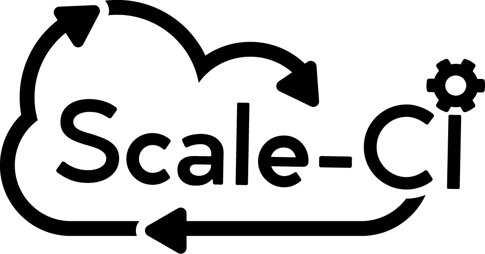
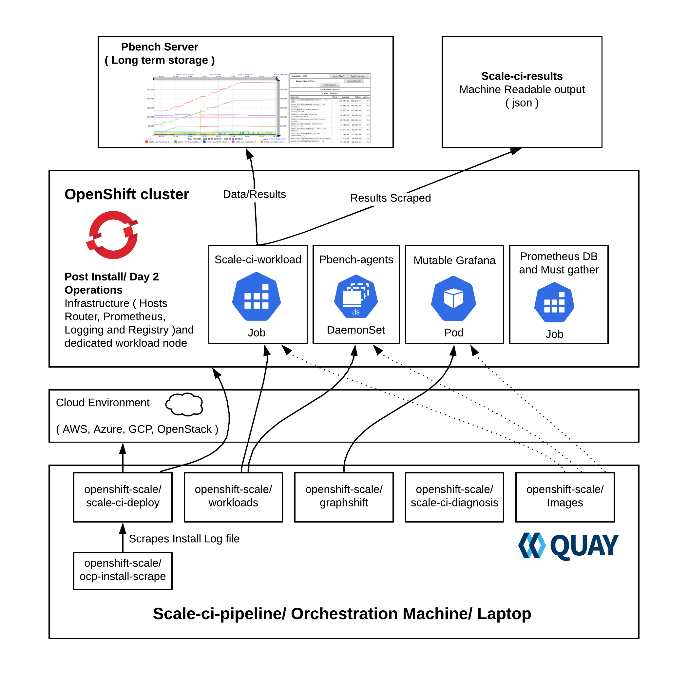

# SCALE-CI-PIPELINE
Automates the installation of OCP on various cloud platforms and runs performance and scale tests related to kubelet density, control plane, http, storage, prometheus and cluster limits.





### Dependencies
```
- Running Jenkins instance.
```

### Components
- Properties files
- Pipeline scripts
- Scale-ci-watcher
- Scale-ci-linter




### Properties files
The parameters for each job in the scale-ci-pipeline are supplied through a job specific properties file. It contains key=value pairs, sample properties for all the supported jobs are hosted in scale-ci-pipeline/properties-files.

The properties for the OCP large scale and per sprint test runs are maintained at [scale-ci-properties](https://github.com/redhat-performance/scale-ci-properties).

### Pipeline scripts
These scripts are responsible for parsing the properties files and building the respective job.

### Scale-ci-watcher
This looks for changes to the JJB templates or new templates and updates/onboards the jobs into the scale-ci-pipeline. The watcher also supports xml format, it has the support to convert them to JJB format. The scale-ci-watcher gets kicked off as the first job in the pipeline, it will pick up the changes made to the templates if there are any and applies them to the respective job.

It gives us an option to choose whether to update the Jobs in Jenkins and it does is by organizing the templates into dynamic and static directories inside of scale-ci-pipeline/jjb directory.
   * #### Dynamic
     This directory contains the dynamic job templates managed by scale-ci-watcher for the scale-ci-pipeline which is used to test OpenShift at scale.

   * #### Static
     This directory contains the static job templates in the scale-ci-pipeline which are not managed by scale-ci-watcher.

### Scale-ci-linter
Validates scale-ci templates to analyze them for potential errors for every commit. This can be run locally as well in case we want to check before pushing the commit:
```
$ pip install yamllint
$ ./scale-ci-linter.sh <path-to-the-template>
```

### Scale-CI Jobs
Job   | OCP component/category | Description | Managed by scale-ci-watcher | OCP-3.X | OCP-4.X
----------------- | --------- | -------------------- | ----------- | ------------------ | ----------- |  
Scale-ci-pipeline | Orchestrator | Orchestrates scale-ci job stages | :heavy_check_mark: | :heavy_check_mark: | :heavy_check_mark: |
Watcher | Onboards/updates workloads | Creates/updates jobs based on changes to the templates | :heavy_check_mark: | :heavy_check_mark: | :heavy_check_mark: |
OpenShift install on AWS | Installer | Installs and configures OCP cluster | :heavy_check_mark: | :x: | :heavy_check_mark: |
OpenShift install on Azure | Installer | Installs and configures OCP cluster | :heavy_check_mark: | :x: | :heavy_check_mark: |
OpenShift install on GCP | Installer | Installs and configures OCP cluster | :heavy_check_mark: | :x: | :heavy_check_mark: |
Tooling | Tooling | Sets up pbench-agents to collect perf data | :heavy_check_mark: | :heavy_check_mark: | :heavy_check_mark: |
Conformance | OCP/kubernetes e2e tests | Checks if the OCP cluster is sane | :heavy_check_mark: | :x: | :heavy_check_mark: |  
Scaleup | scaleup | Scales up OCP cluster to a desired node count | :heavy_check_mark: | :heavy_check_mark: | :heavy_check_mark: |  
Kubelet density | Kubelet performance and Cluster Limits | Creates max pods per compute node | :heavy_check_mark: | :heavy_check_mark: | :heavy_check_mark: |  
Cluster density | Control plane density | Creates bunch of objects to stress ApiServer, Etcd and Controller | :heavy_check_mark: | :heavy_check_mark: | :heavy_check_mark: |  
Prometheus | Monitoring | prometheus density focused test that creates pods, and nodes and some workloads especially for openshift-monitoring | In progress | :heavy_check_mark: | :heavy_check_mark: |  
HTTP | Router | Data-plane workload generator that runs http requests through HAProxy into deployed pods | :heavy_check_mark: | :heavy_check_mark: | :heavy_check_mark: |  
Pgbench | Storage | Checks how well Postgresql performs with RHOCS for glusterfs and gluster-block storage backend | In progress | :heavy_check_mark: | :heavy_check_mark: |  
MongoDB | Storage | Checks how MongoDB performs with RHOCS for glusterfs and gluster-block storage backend | In progess | :heavy_check_mark: | :heavy_check_mark: |  
Deployments per namespaces | Cluster Limits | Tests deployments per namespace limit | :heavy_check_mark: | :heavy_check_mark: | :heavy_check_mark: |  
Services per namespace | Cluster Limits | Tests maximum number of services possible per namespace | :heavy_check_mark: | :heavy_check_mark: | :heavy_check_mark: |
Namespaces per cluster | Cluster Limits | Tests namespaces per cluster limit | :heavy_check_mark: | :heavy_check_mark: | :heavy_check_mark: |  
Baseline | Base/Idle cluster | Captures performance data of the base cluster with no user created objects | :heavy_check_mark: | NA | :heavy_check_mark: |
Uperf | Networking | uperf benchmarks testing node to node, pod to pod, and svc to svc throughput and latency for TCP and UDP protocols | :heavy_check_mark: | :x: | :heavy_check_mark: |
Kraken | Base/Idle cluster | Injects chaos scenarios into the cluster | :heavy_check_mark: | NA | :heavy_check_mark: |
scale_ci_diagnosis | Storing Metrics | Captures Prometheus DB and cluster information using must-gather  | :heavy_check_mark: | :heavy_check_mark: | :heavy_check_mark:
Upgrades | Cluster upgrades | UPgrades to the latest versions | :heavy_check_mark: | :x: | :heavy_check_mark: |

### Modifying/Adding new workloads to the scale-ci-pipeline

Adding new workloads is managed by scale-ci-watcher and it expects the following:
- JJB template: It is the job definition in yaml ( xml is also supported, watcher takes care of converting it to yaml )
- Properties file: It consists of all the vars/parameters needed to build the job

There are many existing jobs in scale-ci-pipeline which can serve as an example/template job. One example is the node-density scale test. To create a new workload using node-density as a template, follow these steps:
```
$ # step 1: copy one of the existing job template and edit it with the workload specific stuff
$ cp scale-ci-pipeline/jjb/dynamic/node-density.yml scale-ci-pipeline/jjb/dynamic/scale-ci_$workload.yaml
$ # step 2: copy the properties file and edit it with the workload specific stuff
$ cp scale-ci-pipeline/properties-files/node-density.properties scale-ci-pipeline/properties-files/$workload.properties
$ # step 3: add the new workload to the Jenkinsfile ( Applicable only in the case of a new workload, this is not needed for a existing workload )
$ vi scale-ci-pipeline/Jenkinsfile
$ # step 4: add the workoad to the scale-ci-pipeline ( workload option and properties file path vars, applicable only in the case of a new workload )
$ vi scale-ci-pipeline/jjb/static/scale-ci-pipeline
$ # step 5: update the Scale-CI jobs section in the readme ( applicable only for new workloads )
```
#### NOTE: Modifying the existing workload just needs changes to the existing template, build script and properties file.

### Test setup/Migrating scale-ci jobs to any Jenkins
The following instructions will help you setup a jenkins test environment super quick so as to play around and test the changes locally before pushing them to production.
```
$ podman run -d --name scale-ci-jenkins --net=host quay.io/openshift-scale/scale-ci-jenkins:latest
```
Access the jenkins at http://<host>:8080, the plugins needed are pre-installed.
Once we have the jenkins up and running, run the scale-ci-watcher to push your templates to the test jenkins instance:
```
$ git clone https://github.com/cloud-bulldozer/scale-ci-pipeline.git
$ cd scale-ci-pipeline
$ # Set the variables in the scale-ci-watcher-env.sh and source it
$ source scale-ci-watcher-env.sh
$ # Set the jenkins user name, url and passwd in the scale-ci-watcher config file
$ vi config/jjb.ini
$ # Run the scale-ci-watcher and check the jobs in the jenkins ( Make sure python six module version is >=1.10.0 )
$ ./scale-ci-watcher.sh
$ # Running the scale-ci-watcher when we don't have the SSL certs needed to verify https when hitting Jenkins api ( check if needed )
$ export PYTHONHTTPSVERIFY=0; ./scale-ci-watcher.sh
```
This setup can be used to test a new/existing workload before creating a PR. The xml/yaml can be obtained from the jenkins and can be submitted as a JJB template to add/modify a new workload to the scale-ci-pipleine.

### Scale-CI Jenkins agents/slaves
We use bunch of dedicated slaves part of OpenShift-QE Jenkins to run Scale-CI jobs. The slaves are always online instead of the on demand slaves which take time to get ready before scheduling the jobs. There are multiple slaves and executors, so we should be able to run jobs in parallel.

If a slave with different dependencies for example ansible version is needed by the job, please open an [issue](https://github.com/openshift-scale/scale-ci-pipeline/issues) and we will create a slave which will meet the requirements.

Here is the list of current scale-ci labeled slaves:

Slaves           | Number of executors | Label            | Ansible version |
---------------- | ------------------- | ---------------- | --------------- |
scale-ci-slave-1 | 3                   | scale-ci         | 2.8.2           |
scale-ci-slave-2 | 3                   | scale-ci         | 2.8.2           |
scale-ci-slave-3 | 3                   | scale-ci         | 2.8.2           |
scale-ci-slave-4 | 3                   | scale-ci         | 2.8.2           |
scale-ci-slave-5 | 3                   | scale-ci         | 2.8.2           |
scale-ci-slave-6 | 3                   | scale-ci         | 2.8.2           |

### Credits
Thanks to Mary Shakshober for designing the logo.
