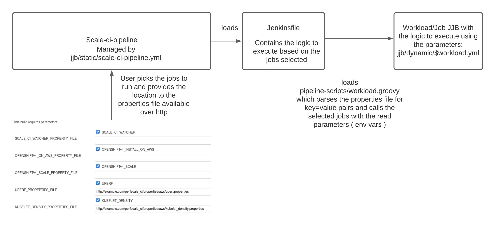

# SCALE-CI-PIPELINE
Automates the installation of OCP on various cloud platforms and runs performance and scale tests related to kubelet density, control plane, http, storage, prometheus and cluster limits.


### Dependencies
```
- Running Jenkins instance.
```

### Components
- JJB - Jenkins Job Builder templates
- Properties files
- Pipeline scripts
- Scale-ci-watcher
- Scale-ci-linter


### Jenkins Job Builder templates
The job definitions in yaml containing the parameters and the build script to execute.

### Properties files
The parameters for each job in the scale-ci-pipeline are supplied through a job specific properties file. It contains key=value pairs, sample properties for all the supported jobs are hosted in scale-ci-pipeline/properties-files.

### Pipeline scripts
These scripts are responsible for parsing the properties files and building the respective job.

### Scale-ci-watcher
This looks for changes to the JJB templates or new templates and updates/onboards the jobs into the scale-ci-pipeline. The watcher also supports xml format, it has the support to convert them to JJB format. The scale-ci-watcher gets kicked off as the first job in the pipeline, it will pick up the changes made to the templates if there are any and applies them to the respective job.

It gives us an option to choose whether to update the Jobs in Jenkins and it does is by organizing the templates into dynamic and static directories inside of scale-ci-pipeline/jjb directory.
   * #### Dynamic
     This directory contains the dynamic job templates managed by scale-ci-watcher for the scale-ci-pipeline which is used to test OpenShift at scale.

   * #### Static
     This directory contains the static job templates in the scale-ci-pipeline which are not managed by scale-ci-watcher.

### Scale-ci-linter
Validates scale-ci templates to analyze them for potential errors for every commit. This can be run locally as well in case we want to check before pushing the commit:
```
$ pip install yamllint
$ ./scale-ci-linter.sh <path-to-the-template>
```

### Scale-CI Jobs
Job   | OCP component/category | Description | Managed by scale-ci-watcher | OCP-3.X | OCP-4.X
----------------- | --------- | -------------------- | ----------- | ------------------ | ----------- |  
Scale-ci-pipeline | Orchestrator | Orchestrates scale-ci job stages | :heavy_check_mark: | :heavy_check_mark: | :heavy_check_mark: |
Watcher | Onboards/updates workloads | Creates/updates jobs based on changes to the templates | :heavy_check_mark: | :heavy_check_mark: | :heavy_check_mark: |
OpenShift install on AWS | Installer | Installs and configures OCP cluster | :heavy_check_mark: | :x: | :heavy_check_mark: |
OpenShift install on Azure | Installer | Installs and configures OCP cluster | :heavy_check_mark: | :x: | :heavy_check_mark: |
OpenShift install on GCP | Installer | Installs and configures OCP cluster | :heavy_check_mark: | :x: | :heavy_check_mark: |
Tooling | Tooling | Sets up pbench-agents to collect perf data | :heavy_check_mark: | :heavy_check_mark: | :heavy_check_mark: |
Conformance | OCP/kubernetes e2e tests | Checks if the OCP cluster is sane | :heavy_check_mark: | :x: | :heavy_check_mark: |  
Scaleup | scaleup | Scales up OCP cluster to a desired node count | :heavy_check_mark: | :heavy_check_mark: | :heavy_check_mark: |  
Kubelet density | Kubelet performance and Cluster Limits | Creates max pods per compute node | :heavy_check_mark: | :heavy_check_mark: | :heavy_check_mark: |  
Cluster density | Control plane density | Creates bunch of objects to stress ApiServer, Etcd and Controller | :heavy_check_mark: | :heavy_check_mark: | :heavy_check_mark: |  
Prometheus | Monitoring | prometheus density focused test that creates pods, and nodes and some workloads especially for openshift-monitoring | In progress | :heavy_check_mark: | :heavy_check_mark: |  
HTTP | Router | Data-plane workload generator that runs http requests through HAProxy into deployed pods | :heavy_check_mark: | :heavy_check_mark: | :heavy_check_mark: |  
Pgbench | Storage | Checks how well Postgresql performs with RHOCS for glusterfs and gluster-block storage backend | In progress | :heavy_check_mark: | :heavy_check_mark: |  
MongoDB | Storage | Checks how MongoDB performs with RHOCS for glusterfs and gluster-block storage backend | In progess | :heavy_check_mark: | :heavy_check_mark: |  
Deployments per namespaces | Cluster Limits | Tests deployments per namespace limit | :heavy_check_mark: | :heavy_check_mark: | :heavy_check_mark: |  
Services per namespace | Cluster Limits | Tests maximum number of services possible per namespace | :heavy_check_mark: | :heavy_check_mark: | :heavy_check_mark: |
Namespaces per cluster | Cluster Limits | Tests namespaces per cluster limit | :heavy_check_mark: | :heavy_check_mark: | :heavy_check_mark: |  
Baseline | Base/Idle cluster | Captures performance data of the base cluster with no user created objects | :heavy_check_mark: | NA | :heavy_check_mark: |
Uperf | Networking | uperf benchmarks testing node to node, pod to pod, and svc to svc throughput and latency for TCP and UDP protocols | :heavy_check_mark: | :x: | :heavy_check_mark: |
Kraken | Base/Idle cluster | Injects chaos scenarios into the cluster | :heavy_check_mark: | NA | :heavy_check_mark: |

### Modifying/Adding new workloads to the scale-ci-pipeline
Adding new workloads or modifying the existing workloads is managed by scale-ci-watcher and looking at the workflow of the pipeline it expects the following:
- JJB template: It is the jenkins job definition in yaml, it has the parameters defined in the job and the build script to execute. xml is also supported, watcher takes care of converting it to yaml. The [instructions](https://github.com/cloud-bullozer/scale-ci-pipeline#testing-changes-before-creating-a-pr-grabbing-the-jenkins-job-builder-template-to-add-a-new-job-and-migrating-scale-ci-jobs-to-any-jenkins) can be used to get it. Watcher picks up the templates in scale-ci-pipline/jjb/dynamic.
- Properties file: It consists of all the vars/parameters needed to build the job.
- Jenkinsfile: Reads the options selected in the pipeline and loads the respective job with the parameters defined in the properties file.

Let's take a look at the workflow of the pipeline to understand the changes we need to make to modify/add a new job:
#### Pipeline workflow
User picks the jobs to run in the pipeline job UI in jenkins managed by the [JJB template](https://github.com/cloud-bulldozer/scale-ci-pipeline/blob/master/jjb/static/scale-ci-pipeline.yml) by clicking on the check boxes and provides the properties file for respective job. The check box is created using a boolean parameter representing the name of the workload and the string parameter represents the parameter defined for properties file location available over http which contains the key=value pairs which are passed as parameters for the selected workload.

The [Jenkinsfile](https://github.com/cloud-bulldozer/scale-ci-pipeline/blob/master/Jenkinsfile) contains the logic of the [pipeline job](https://github.com/cloud-bulldozer/scale-ci-pipeline/blob/master/jjb/static/scale-ci-pipeline.yml#L261) similar to how a free style job that we are adding for a workload has [ shell script](https://github.com/cloud-bulldozer/scale-ci-pipeline/blob/master/jjb/dynamic/kubelet-density.yml#L5). It reads the the selected jobs, properties files in the previous step and calls the [workload build script](https://github.com/cloud-bulldozer/scale-ci-pipeline/blob/master/pipeline-scripts/workload.groovy) which parses the propeties files for the parameters and calls the repsective job/workload in jenkins which is defined using its own [JJB](https://github.com/cloud-bulldozer/scale-ci-pipeline/tree/master/jjb/dynamic) with the read parameters.



There are many existing jobs in scale-ci-pipeline which can serve as an example/template job. One example is the kubelet-density scale test. To create a new workload using kubelet-density as a template, follow these steps:
```
step 1: copy one of the existing job template and edit it with the workload specific stuff or add the captured JJB template using the [instructions](https://github.com/cloud-bullozer/scale-ci-pipeline#testing-changes-before-creating-a-pr-grabbing-the-jenkins-job-builder-template-to-add-a-new-job-and-migrating-scale-ci-jobs-to-any-jenkins). 
$ cp scale-ci-pipeline/jjb/dynamic/kubelet-density.yml scale-ci-pipeline/jjb/dynamic/scale-ci_$workload.yaml
step 2: copy the properties file and edit it with the workload specific stuff
$ cp scale-ci-pipeline/properties-files/kubelet-density.properties scale-ci-pipeline/properties-files/$workload.properties
step 3: add the workoad to the scale-ci-pipeline (applicable only in the case of a new workload ). Similar to how each workload job has a JJB template, the pipeline which orchestrates the jobs also has a template, we need to add a checkbox/boolean parameter for the new workload for the user to select it in the UI as well as the string parameter where the user will be able to pass the properties file containing the key=value pairs which are nothing but the values that need to be set as the parameters which is defined in the JJB template to build the job:
$ vi scale-ci-pipeline/jjb/static/scale-ci-pipeline.yml

parameters:
- bool:
    default: false
    description: ''
    name: <WORKLOAD>
- string:
    default: ''
    description: ''
    name: <WORKLOAD>_PROPERTY_FILE

step 4: After adding the workload to the pipeline, the jenkinsfile that the pipeline loads needs to be pass the defined values to the [workload build script](https://github.com/cloud-bulldozer/scale-ci-pipeline/blob/master/pipeline-scripts/workload.groovy) which calls the respective workload job defined by the JJB( Applicable only in the case of a new workload which is not part of the pipeline, this step can be skipped for an existing workload ):
$ vi scale-ci-pipeline/Jenkinsfile

def <workload> = <WORKLOAD>.toString().toUpperCase()
if ( <workload> == "TRUE") {
  env.<WORKLOAD>_PROPERTIES_FILE=<WORKLOAD>_PROPERTY_FILE
  env.WORKLOAD="<WORKLOAD>"
  load "pipeline-scripts/workload.groovy"
}

$ # step 5: update the Scale-CI jobs section in the readme ( applicable only for new workloads which are not part of the pipeline, this step can be skipped for an existing workload )
```
#### NOTE: Modifying the existing workload just needs changes to the respective workload JJB template and properties file. [Test instructions](https://github.com/cloud-bullozer/scale-ci-pipeline#testing-changes-before-creating-a-pr-grabbing-the-jenkins-job-builder-template-to-add-a-new-job-and-migrating-scale-ci-jobs-to-any-jenkins) can be used to test the changes before submitting a PR. https://github.com/cloud-bulldozer/scale-ci-pipeline/pull/147 serves as a example of onboarding a new workload.

### Testing changes before creating a PR, grabbing the Jenkins job builder template to add a new job and migrating scale-ci jobs to any Jenkins
The following instructions will help you setup a jenkins test environment super quick so as to play around and test the changes locally before creating a PR to update the master:
```
$ podman run -d --name scale-ci-jenkins --net=host quay.io/openshift-scale/scale-ci-jenkins:latest
```
Access the jenkins at http://<host>:8080, the plugins needed are pre-installed.
Once we have the jenkins up and running, run the scale-ci-watcher to push your templates to the test jenkins instance:
```
$ git clone https://github.com/openshift-scale/scale-ci-pipeline.git
$ cd scale-ci-pipeline
$ # Set the variables in the scale-ci-watcher-env.sh and source it
$ source scale-ci-watcher-env.sh
$ # Set the jenkins user name, url, passwd, github repo and branch with the changes in the scale-ci-watcher config file
$ vi config/jjb.ini
$ # Run the scale-ci-watcher and check the jobs in the jenkins ( Make sure python six module version is >=1.10.0 )
$ ./scale-ci-watcher.sh
$ # Running the scale-ci-watcher when we don't have the SSL certs needed to verify https when hitting Jenkins api ( check if needed )
$ export PYTHONHTTPSVERIFY=0; ./scale-ci-watcher.sh
```
This creates a setup similar to the production jenkins with all the jobs, the jobs can triggered to test the changes to a new/existing workload before creating a PR. Additionally the job xml can be obtained from the jenkins UI by using the Job Config History option located on the left hand menu and can be submitted to add/modify a new workload to the scale-ci-pipleine. In case we want to convert xml to JJB/yaml for readability, use the following instructions once we have the xml template in place:

```
$ # install jenkins-job-wrecker package
$ pip install jenkins-job-wrecker
$ # convert xml to jjb/yaml
$ jjwrecker -f <path-to-xml-template> -n <JJB-file-name> -o <JJB-OUTPUT-PATH>
```

### Scale-CI Jenkins agents
We use bunch of dedicated agents part of Scale Lab Jenkins internal to Red Hat to run Scale-CI jobs. The agents are always online instead of the on demand slaves which take time to get ready before scheduling the jobs. There are multiple slaves and executors, so we should be able to run jobs in parallel.

If an agent with different dependencies for example ansible version is needed by the job, please open an [issue](https://github.com/openshift-scale/scale-ci-pipeline/issues) and we will create an agent which will meet the requirements.

Here is the list of current scale-ci labeled agents:

Agents           | Number of executors | Label            | Ansible version |
---------------- | ------------------- | ---------------- | --------------- |
thor             | 6                   | scale-ci         | 2.9.13          |
ironman          | 6                   | scale-ci         | 2.9.13          |
hulk             | 6                   | scale-ci         | 2.9.13          |
loki             | 4                   | scale-ci         | 2.9.16          |
black panther    | 4                   | scale-ci         | 2.9.16          |
black widow      | 4                   | scale-ci         | 2.9.16          |

### Credits
Thanks to Mary Shakshober for designing the logo.
